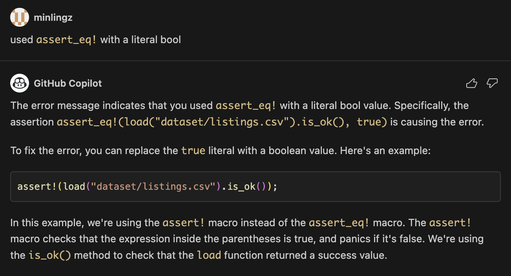
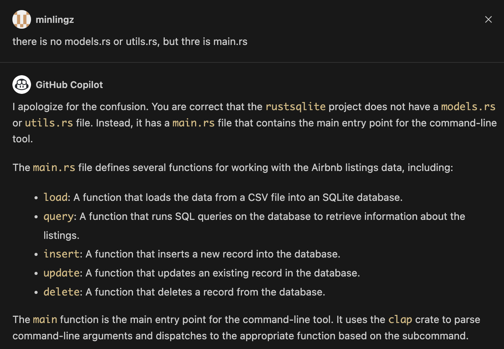
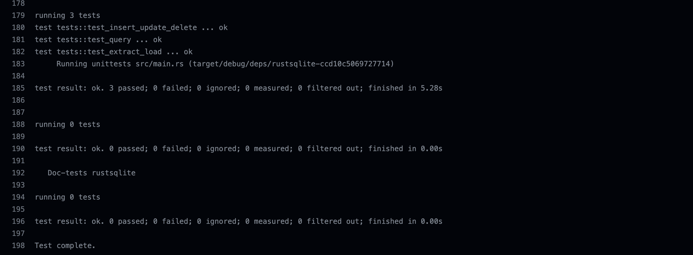

# Rust SQLite ETL

Rust CLI Binary with SQLite

## Diagram


(Following content were generated with the help of Github Copilot chat.)

## Description

`rustsqlite` is a Rust library for working with SQLite databases. SQLite is a popular embedded database engine that provides a lightweight and efficient way to store and retrieve data.

The rust-sqlite library provides a high-level API for working with SQLite databases in Rust. It allows you to create, read, update, and delete data in an SQLite database using Rust code.

The library provides a number of useful features, including:

* A simple and intuitive API for working with SQLite databases
* Support for transactions and prepared statements
* Support for custom functions and aggregates
* Support for user-defined types and collations

A flexible and extensible architecture that allows you to customize the behavior of the library
The rust-sqlite library is widely used in the Rust community and is considered to be one of the best SQLite libraries available for Rust.

The rustsqlite project that you provided is an example project that demonstrates how to use the rust-sqlite library to build a simple command-line tool for working with Airbnb listings data. The project includes code for loading data from a CSV file into an SQLite database, and for querying the database to retrieve information about the listings.

The project is organized into several modules, including:

* `lib.rs` - The main module that defines the load and query functions for loading data into the database and querying the database, respectively.
* `main.rs` - The main main entry point for the command-line tool. It uses the clap crate to parse command-line arguments and dispatches to the appropriate function based on the subcommand.

    The `main.rs` file defines several functions for working with the Airbnb listings data, including:

    * `extract`: A function that extracts the dataset from internet and save it as a CSV file.
    * `load`: A function that loads the data from a CSV file into an SQLite database.
    * `query`: A function that runs SQL queries on the database to retrieve information about the listings.
    * `insert`: A function that inserts a new record into the database.
    * `update`: A function that updates an existing record in the database.
    * `delete`: A function that deletes a record from the database.

## How to use the rustsqlite project

Here's an example of how to extract the dataset from internet and save it as a CSV file:

```bash
$ cargo run extract
```

You can use the rustsqlite command-line tool to load the Airbnb listings data into an SQLite database:

```bash
$ cargo run load
```

In this example, we're using the cargo run command to run the rustsqlite command-line tool with the load subcommand. The load subcommand loads the Airbnb listings data from the listings.csv file into an SQLite database named airbnb.db.

Once the data is loaded into the database, we can use the query subcommand to run SQL queries on the database to retrieve information about the listings. For example:

```bash
$ cargo run query
```

In this example, we're using the query subcommand to run a SQL query on the airbnb.db database. The query Read the database and return the average price per night for each neighbourhood.

You can also use the rustsqlite command-line tool to run CRUD SQL queries on the database. For example:

```bash
$ cargo run insert
```

In this example, we're using the insert subcommand to run a SQL query on the airbnb.db database. The query inserts a new listing into the database.

```bash
$ cargo run update
```

In this example, we're using the update subcommand to run a SQL query on the airbnb.db database. The query updates the price of the inserted in the database to $2000 per night.
    
```bash
$ cargo run delete
```

In this example, we're using the delete subcommand to run a SQL query on the airbnb.db database. The query deletes the listing from the database.

## Dependencies and how to install them

The rustsqlite project depends on several Rust crates, which are listed in the `Cargo.toml` file. To install these dependencies, you can use the cargo command-line tool, which is included with Rust.

Here are the steps to install the dependencies for the rustsqlite project:

1. Install Rust: If you haven't already installed Rust, you can download and install it from the official Rust website: https://www.rust-lang.org/tools/install

2. Clone the rustsqlite repository: You can clone the rustsqlite repository from GitHub using the following command:
    
```bash
git clone https://github.com/minlingz/rust-sqlite
```

3. Change to the rustsqlite directory: Use the following command to change to the rustsqlite directory:

```bash
cd rustsqlite
```

4. Install the dependencies: Use the following command to install the dependencies listed in the Cargo.toml file:

```bash
cargo build
```

This command will download and install the dependencies for the rustsqlite project. It may take a few minutes to complete, depending on your internet connection and the speed of your computer.

Once the dependencies are installed, you can use the cargo command-line tool to build and run the rustsqlite project. 

## Use of GitHub Copilot
The rustsqlite project leverage GitHub Copilot to generate code and documentation for the project. GitHub Copilot is an AI-powered pair programmer that helps you write better code. It learns from your codebase and uses that knowledge to assist you as you write code. Here is an example of how GitHub Copilot helped me debug the error in writing the test case for the project:



Copilot can also help you write documentation for your project. Here is an example of how Copilot helped me write the documentation for the project and how it took the feedback from me to improve the documentation:



## SQLite CRUD operations

### Create
The rustsqlite project includes a create operation that allows you to create a new listing in the database. The create subcommand takes the following arguments:
```rust
pub fn load(dataset: &str) -> Result<(), Box<dyn Error>> {
    // load dataset into sqlite database
    ...
    // drop table if exists
    ...
    // create table
    let create_table = format!("CREATE TABLE airbnb ({})", headers.join(", "));
    conn.execute::<&[&dyn ToSql]>(&create_table, &[])?;
    ...
}
```

### Read
The rustsqlite project includes a read operation that allows you to read the data from the database. The read subcommand takes the following arguments:
```rust
pub fn query(limit: i64) -> Result<()> {
    //Read the database and return the average price per night for each neighbourhood
    let conn = Connection::open("dataset/airbnb.db")?;
    let count: i64 = conn.query_row("SELECT COUNT(*) FROM airbnb", params![], |row| row.get(0))?;
    println!("Number of rows in the airbnb table: {}", count);
    let mut stmt = conn.prepare(
        "SELECT neighbourhood, AVG(CAST(price AS REAL)) AS avg_price_per_night \
         FROM airbnb \
         GROUP BY neighbourhood \
         ORDER BY avg_price_per_night DESC \
         LIMIT ?",
    )?;
    let rows = stmt.query_map(params![limit], |row| {
        Ok((row.get::<_, String>(0)?, row.get::<_, f64>(1)?))
    })?;
    for row in rows {
        let (neighbourhood, avg_price_per_night) = row?;
        println!("{}: ${:.2}/night", neighbourhood, avg_price_per_night);
    }
    Ok(())
}
```

### Update
The rustsqlite project includes an update operation that allows you to update the data in the database. The update subcommand takes the following arguments:
```rust
pub fn update() -> Result<(), Box<dyn Error>> {
    // update a record in the database
    let conn = Connection::open("dataset/airbnb.db")?;
    conn.execute(
        "UPDATE airbnb SET price = ?1 WHERE neighbourhood = ?2",
        params!["20000", "Dummy"],
    )?;
    Ok(())
}
```

### Delete
The rustsqlite project includes a delete operation that allows you to delete the data from the database. The delete subcommand takes the following arguments:
```rust
pub fn delete() -> Result<(), Box<dyn Error>> {
    // delete a record from the database
    let conn = Connection::open("dataset/airbnb.db")?;
    conn.execute("DELETE FROM airbnb WHERE neighbourhood = ?1", params!["Dummy"])?;
    Ok(())
}
```

## Github Actions

### Build and release
This project includes a GitHub Actions workflow that automatically builds and tests the project whenever a new commit is pushed to the repository. The workflow is defined in the `.github/workflows/build_release.yml` file.

The workflow is triggered by the push event, which is fired whenever a new commit is pushed to the repository, it then generates an optimized Rust binary as a GitHub Actions artifact that can be downloaded. The workflow runs the following steps:

```yml
    steps:
        - name: Checkout code
            uses: actions/checkout@v2
        
        - name: Change directory
            run: cd rustsqlite && ls -la

        - name: Build binary
            run: cd rustsqlite && cargo build --release

        - name: Upload artifact
            uses: actions/upload-artifact@v2
            with:
            name: rustsqlite
            path: rustsqlite/target/release/rustsqlite
```
Example of the output:


### Tests
The rustsqlite project includes a GitHub Actions workflow that automatically tests the project whenever a new commit is pushed to the repository. The workflow is defined in the `.github/workflows/tests.yml` file.

```yml
    steps:
      - uses: actions/checkout@v1
      - uses: actions-rs/toolchain@v1
        with:
          toolchain: stable
          profile: minimal
          components: clippy, rustfmt
          override: true
      - name: Run clippy
        run: make test
```
It uses built-in Cargo commands to run the tests defined in the `lib.rs`. The tests are defined in the `lib.rs` directory and are run using the `cargo test` command.

```rust
mod tests {
    use super::*;
    use std::path::Path;

    #[test]
    fn test_extract_load() {
        let url = "https://anlane611.github.io/ids702-fall23/DAA/listings.csv";
        let file_path = "dataset/listings.csv";
        let _file_path = extract(url, Some(file_path)).unwrap();
        assert!(Path::new(file_path).exists());
        assert!(load("dataset/listings.csv").is_ok());
    }
 
    #[test]
    fn test_insert_update_delete() {
        assert!(insert().is_ok());
        assert!(update().is_ok());
        assert!(delete().is_ok());
    }

    #[test]
    fn test_query() {
        assert!(query(5).is_ok());
    }
} 
```
Example of the test output using Github Actions:



### Lint
The rustsqlite project includes a GitHub Actions workflow that automatically lint the project whenever a new commit is pushed to the repository. The workflow is defined in the `.github/workflows/lint.yml` file.

```yml
    steps:
      - uses: actions/checkout@v1
      - uses: actions-rs/toolchain@v1
        with:
          toolchain: stable
          profile: minimal
          components: clippy, rustfmt
          override: true
      - name: Run clippy
        run: make lint
```

## Youtube demo
Youtube demo can be found https://youtu.be/5fUqRmFkOe8 
